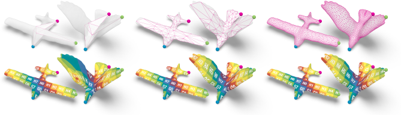

# Surface Maps via Adaptive Triangulations

<!--This is a prototype implementation of the paper Surface Map Surface Maps via Adaptive Triangulations [paper link] by [authors].-->
This is a prototype implementation of Surface Map Surface Maps via Adaptive Triangulations.

This repository contains:
* The core `SurfaceMaps` library.
* Example applications that replicate figures from the paper.


# Build Instructions

This project has been developed and tested on Linux (Debian & Ubuntu) and requires a C++17 compiler.

On Debian-based systems, the required dependencies can be installed via:
```
sudo apt install cmake libgl1-mesa-dev mesa-utils libglfw3 libglfw3-dev libxinerama-dev libxcursor-dev libxi-dev cmake g++
```

Clone and build the project using the following commands:
```
git clone --recursive https://github.com/patr-schm/surface-maps-via-adaptive-triangulations.git
cd surface-maps-via-adaptive-triangulations
mkdir build
cd build
cmake ..
make -j4
```

# Run Instructions

The `build` directory should now contain several executable files. Run a file by typing e.g.:

* `./coarse_to_fine` (which reproduces the results of Figure 2 in the paper)



Each executable will produce a number of output meshes and screenshots in the `build/output` directory.
Alternatively, it is possible to open an interactive viewer by setting `open_viewer = true` in any of the files located in `apps/adaptive_triangulations`.

Viewer navigation:

* Drag left mouse button to rotate
* Double-click to set pivot point
* Scroll mouse wheel to zoom

Press Escape to close the widget. Some demos will open several widgets in succession.

# Authors and Contributors
[tba]

# Citation
[...]

# License
Our source code is released under the MIT License.
