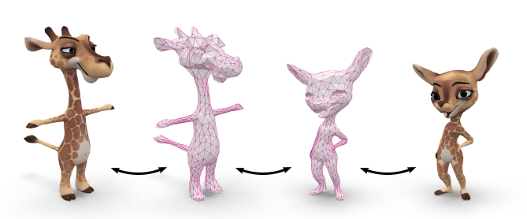
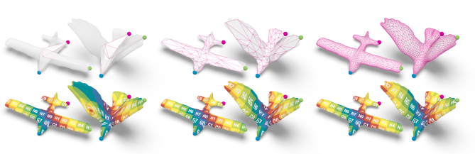

# Surface Maps via Adaptive Triangulations

This is a prototype implementation of the paper [Surface Maps via Adaptive Triangulations](https://graphics.rwth-aachen.de/media/papers/345/surface-maps-via-adaptive-triangulations.pdf) (Eurographics 2023) by Patrick Schmidt, Dörte Pieper, and Leif Kobbelt.

The method computes bijective maps, represented via common triangulations, between two or more genus-0 surfaces.
Such common triangulations approximate the input surfaces but stay in bijective correspondence to them (via spherical embeddings).
A discrete-continuous algorithm optimizes the geometric embeddings as well as the connectivity of these triangulations.

The repository contains:
* The core `SurfaceMaps` library.
* Example applications that replicate figures from the paper.


# Build Instructions

This project has been developed and tested on Linux (Debian & Ubuntu) and requires a C++17 compiler. Install the dependencies via:
```
sudo apt install cmake libgl1-mesa-dev mesa-utils libglfw3 libglfw3-dev libxinerama-dev libxcursor-dev libxi-dev g++
```

Clone and build the project using the following commands:
```
git clone --recursive https://github.com/patr-schm/surface-maps-via-adaptive-triangulations.git
cd surface-maps-via-adaptive-triangulations
mkdir build
cd build
cmake ..
make -j4
```

# Run Instructions

The `build` directory should now contain several executable files. Run a file by typing e.g.:

* `./coarse_to_fine` (which reproduces the results of Figure 2 in the paper)



Each executable will produce a number of output meshes and screenshots in the `build/output` directory.
Alternatively, it is possible to open an interactive viewer by setting `open_viewer = true` in any of the files located in `apps/adaptive_triangulations`.

Viewer navigation:

* Drag left mouse button to rotate
* Double-click to set pivot point
* Scroll mouse wheel to zoom

Press Escape to close the window. Some demos will open several windows in succession.

# Authors
* [Patrick Schmidt](https://www.graphics.rwth-aachen.de/person/232/)  
* Dörte Pieper
* [Leif Kobbelt](https://www.graphics.rwth-aachen.de/person/3/)  

# Citation
```
@article{schmidt2023surface,
  title={Surface Maps via Adaptive Triangulations},
  author={Schmidt, Patrick and Pieper, D\"orte and Kobbelt, Leif},
  year={2023},
  journal={Computer Graphics Forum},
  volume={42},
  number={2},
}
```

# License
Our source code is released under the MIT License.
